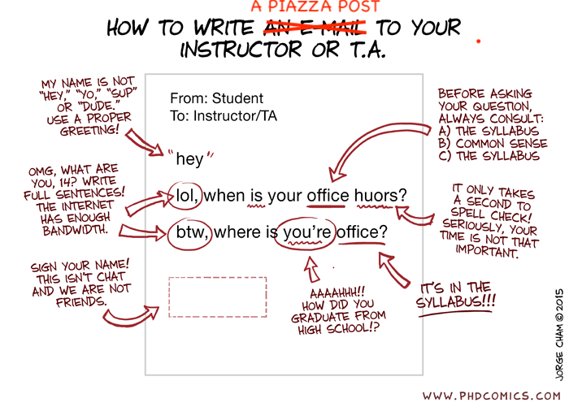

# CAS CS 630 - Graduate Algorithms - Fall 2026

---

## Course Staff

<table class="staff-table">
    <tr>
        <td class="role">Instructors</td>
        <td>
            <a href="https://cs-people.bu.edu/edori/">Prof. Dora Erdös</a> 
            <a href="https://cs-people.bu.edu/januario/">Prof. Tiago Januario</a>
        </td>
    </tr>
    <tr>
        <td class="role">Teaching Fellow</td>
        <td>
            <a href="https://pjalalifr.github.io">Pooria Jalali</a> 
        </td>
    </tr>
    <tr>
        <td class="role">Grader</td>
        <td>
            <a href="https://www.linkedin.com/in/jerinjoseph121/">Jerin Joseph</a> 
        </td>
    </tr>
</table>
---

## Communication and Office hours

  

  <ul>
      <li><a href="https://piazza.com/" target="_blank">Piazza</a> is the <strong>primary platform</strong> for all online discussions, questions, and answers.
        <ul>
          <li>Use <strong>private posts</strong> for sensitive or specific questions regarding your solutions or personal matters.</li>
          <li><b>Do not send emails</b> to the course staff.</li>
        </ul>
      </li>
      <li>We aim to maintain a <strong>positive and inclusive atmosphere</strong> on all course platforms.</li>
      <li>If you need <strong>special accommodations</strong> or are facing <strong>unusual circumstances</strong> during the semester, please reach out to an instructor privately via Piazza as early as possible.
        <ul>
          <li>For accommodations, forward relevant documentation from <a href="https://www.bu.edu/disability/">Disability and Access Services</a>.</li>
        </ul>
      </li>
      <li>Your <strong>suggestions</strong> for improving the course are always encouraged and appreciated.</li>
    </ul>
  

  

  

*   Check our [Google Calendar](https://calendar.google.com/calendar/embed?height=600&wkst=1&ctz=America%2FNew_York&showPrint=0&mode=WEEK&src=Y180MTRmM2U0Y2JiODU3N2UxYjM0NmZmMDY4YzBkNzY5MTZiOWYxZWE0ZDZkZDIzNmZiYTU3MTk2MjI5MTRjY2M4QGdyb3VwLmNhbGVuZGFyLmdvb2dsZS5jb20&color=%233f51b5) for our Office hours.

<iframe src="https://calendar.google.com/calendar/embed?height=600&wkst=1&ctz=America%2FNew_York&showPrint=0&mode=WEEK&src=Y180MTRmM2U0Y2JiODU3N2UxYjM0NmZmMDY4YzBkNzY5MTZiOWYxZWE0ZDZkZDIzNmZiYTU3MTk2MjI5MTRjY2M4QGdyb3VwLmNhbGVuZGFyLmdvb2dsZS5jb20&color=%233f51b5" style="border:solid 1px #777" width="800" height="600" frameborder="0" scrolling="no"></iframe>

---
## Prerequisites

This course is designed for Computer Science graduate students aiming to satisfy core theoretical requirements or build a foundation for advanced research. It is also open to advanced undergraduates (typically juniors or seniors) who have excelled in introductory algorithms (such as CAS CS 330) and possess the mathematical maturity required for graduate-level theory.

* **Undergraduate prerequisite**
    * CS330 Introduction to Analysis of Algorithms

* **Graduate prerequisite**
    * An algorithms course at the level of CS330. If you’re not sure whether you have the background, you must talk to the instructor.
    * Topics that you should be familiar with from your previous studies:
        * Proof techniques (e.g. direct proof, proof by contradiction, induction)
        * Data structures (e.g. lists, queues, heaps, hash tables, trees, graph adjacency list)
        * Asymptotic analysis of running time (i.e. big-Oh)
        * Algorithm design paradigms, such as greedy, divide and conquer, dynamic programming, various graph algorithms

Note that this course is intended for MS and advanced BA students. **PhD students should take
CS530 instead**.

---
## Syllabus

This course examines advanced algorithmic topics and methods for CS graduate students, including matrix decomposition techniques and applications, linear programming, fundamental discrete and continuous optimization methods, probabilistic algorithms, NP-hard problems and approximation techniques, and algorithms for very large data sets.

* **Course Objectives**
    * By the conclusion of this course, students will be able to identify and prove when a computational problem is NP-hard, and design effective approximation algorithms or local search heuristics with provable performance guarantees, design and analyze probabilistic (randomized) algorithms to achieve better average-case efficiency, lower space complexity, or simpler implementations than traditional deterministic alternatives.

---
## Resources

Sign up ASAP:

* **Piazza**:
    * [https://piazza.com/bu/fall2026/cs630](https://piazza.com/bu/fall2026/cs630)
* **Gradescope**:
    * [https://www.gradescope.com/courses/000000](https://www.gradescope.com/courses/000000)
    * Entry Code: AAAAAA
* **TopHat**: A platform for in-class interaction and questions. You have to purchase a membership, there are semester and year-long options. If you use TopHat in multiple courses, you only have to pay the fee once.
    * [https://app.tophat.com/](https://app.tophat.com/)
    * course code 000000
* **iClicker**: A platform for in-class interaction and questions. You have to purchase a Pro membership, there are semester and year-long options.
    * [https://join.iclicker.com/ZSDO](https://join.iclicker.com/ZSDO)

---
## Attendance

*   Attendance in lectures and discussion is mandatory
*   The two lecture sections of the course will be treated as one class. However, you must attend the section you are signed up for (please discuss with us if there is an issue).
*   The content of the two lectures is identical, and assignments will be shared.

---
## Textbooks

There is no one textbook that covers every topic in this course. Hence, instead we will post the reading material prior to each lecture. There are also many resources - such as lecture notes, book chapters, tutorials and videos - publicly available. We encourage you
to seek out those resources too for additional learning.

Some useful textbooks:

* [Algorithm Design, by Kleinberg and Tardos](https://www.pearson.com/en-us/subject-catalog/p/algorithm-design/P200000003259/9780137546350?srsltid=AfmBOoohtVV4wxqb0YsNmueTOh672kvs4WnW5B5KNwscHMxVxYfMiqyW)
* [Introduction to Algorithms, by Cormen, Leiserson, Rivest, and Stein](https://mitpress.mit.edu/9780262046305/introduction-to-algorithms/)
* [Algorithms, by Dasgupta, Papadimitriou, Vazirani](https://cseweb.ucsd.edu/~dasgupta/book/index.html)
* [Approximation Algorithms, by V. Vazirani](https://link.springer.com/book/10.1007/978-3-662-04565-7)
* [The Design of Approximation Algorithms, by Williamson and Shmoy](https://www.designofapproxalgs.com)
* [Randomized Algorithms, by Rajeev Motwani and Prabhakar Raghavan](https://www.cambridge.org/core/books/randomized-algorithms/6A3E5CD760B0DDBA3794A100EE2843E8)
* [A First Course in Randomized Algorithms, by Nick Harvey](https://www.cs.ubc.ca/~nickhar/Book1.pdf)

For prerequisite review:

* [Algorithms Illuminated, by Tim Roughgarden](https://www.algorithmsilluminated.org) (the 4th part of the book also contains
material on NP)
* [Algorithms, by Jeff Erickson](https://jeffe.cs.illinois.edu/teaching/algorithms/book/Algorithms-JeffE.pdf)
* [Mathematics for Computer Science by Eric Lehman, Tom Leighton, and Albert Meyer](https://people.csail.mit.edu/meyer/mcs.pdf)(Useful background on discrete mathematics.)

---
## Schedule

This schedule is subject, and likely, to change as we progress through the semester. Reading chapters are from the [first textbook](https://cs-people.bu.edu/aene/cs237fa21/mcs.pdf) (LLM) or from the [second textbook](https://www.probabilitycourse.com/) (P), referred to by the acronyms of the author names.

<table>
    <thead>
        <tr>
            <th>Date / Lec</th>
            <th>Agenda (Topics, Readings, Homework)</th>
            <th>Instr.</th>
        </tr>
    </thead>
    <tbody>
        <tr>
            <td> <strong>Lec 1</strong>  Thursday  Sep 3 </td>
            <td> <b>Topics</b>: Course logistics  
                 <b>Read</b>: Syllabus  
                 <b>Do</b>: Sign up to websites listed under resources
            </td>
            <td> Dora </td>
        </tr>
        <tr>
            <td> <strong>Lec 2</strong>  Tuesday  Sep 8 </td>
            <td> <b>Topics</b>: Complexity classes, NP-hard, NP-C problems  
                <b>Read</b>:   
                <b>Do:</do>
            </td>
            <td> Dora </td>
        </tr>
        <tr>
            <td> <strong>Lec 3</strong>  Thursday  Sep 10 </td>
            <td> <b>Topics</b>: Np-hard continued: more reductions, Feedback Arc Set  
                 <b>Read</b>:   
                 <b>Do:</do>
            </td>
            <td> Dora </td>
        </tr>
        <tr>
            <td> <strong>Lec 4</strong>  Tuesday  Sep 15 </td>
            <td> <b>Topics</b>: Approximation algos I. def and simple examples  see slides F24/09/24: find acyclic subgraph, VC 2-approx,  IS (D+1)-approx, Set Cover greedy with (k ln n )-approx proof </td>
            <td> Tiago </td>
        </tr>
        <tr>
            <td> <strong>Lec 5</strong>  Thursday  Sep 17 </td>
            <td> <b>Topics</b>: finish greedy set cover (if needed), load balancing 2-approx ad 3/2-approx.  LB: see slides F22/10/06 </td>
            <td> Tiago </td>
        </tr>
        <tr>
            <td> <strong>Lec 6</strong>  Tuesday  Sep 22 </td>
            <td> <b>Topics</b>: center selection problem  see slides F24/09/26 </td>
            <td> Tiago </td>
        </tr>
        <tr>
            <td> <strong>Lec 7</strong>  Thursday  Sep 24 </td>
            <td> <b>Topics</b>: bin packing  see slides F24/10/03 </td>
            <td> Tiago </td>
        </tr>
        <tr>
            <td> <strong>Lec 8</strong>  Tuesday  Sep 29 </td>
            <td> <b>Topics</b>: TSP approx  see slides F24/10/08 - uses MST. quick review of what MST is </td>
            <td> Dora </td>
        </tr>
        <tr>
            <td> <strong>Lec 9</strong>  Thursday  Oct 1 </td>
            <td> <b>Topics</b>: MSTs implementation: union-find, using amortized analysis  MST algos: Kruskal's and Boruvka. Union-find for implementation, amortized analysis of runtime </td>
            <td> Dora </td>
        </tr>
        <tr>
            <td> <strong>Lec 10</strong>  Tuesday  Oct 6 </td>
            <td> <b>Topics</b>: extra buffer lecture  finish remaining topics, optional other advanced data structures, e.g. some kind of self-adjusting trees? </td>
            <td> Dora </td>
        </tr>
        <tr>
            <td> <strong>Lec 11</strong>  Thursday  Oct 8 </td>
            <td> <b>Topics</b>: sorting: worst/best/runtime, amortized analysis, expected runtime, recurrences  goal: get a better understanding of runtime analysis; especially that while worst case is often bad, we can expect better in practice. How we can quantify/compute this. Intro to some basic notions of probability; basic idea of randomization in algo, expected values. see slides F24/11/12 </td>
            <td> Tiago </td>
        </tr>
        <tr class="special-event">
            <td style="background-color: LightYellow"> <strong>No Lec</strong>  Tuesday  Oct 13 </td>
            <td style="background-color: LightYellow">
                Substitute Monday Schedule of Classes 
                
 Check the <a
                        href="https://calendar.google.com/calendar/embed?height=600&wkst=1&ctz=America%2FNew_York&showPrint=0&mode=WEEK&src=Y180MTRmM2U0Y2JiODU3N2UxYjM0NmZmMDY4YzBkNzY5MTZiOWYxZWE0ZDZkZDIzNmZiYTU3MTk2MjI5MTRjY2M4QGdyb3VwLmNhbGVuZGFyLmdvb2dsZS5jb20&color=%233f51b5">Google
                        Calendar</a> for the updated office hour schedule 

            </td>
            <td style="background-color: LightYellow"> </td>
        </tr>
        <tr>
            <td> <strong>Lec 12</strong>  Thursday  Oct 15 </td>
            <td> <b>Topics</b>: notions of probability, Karger's rnd min-cut algo &amp; analysis  In these three lectures you have to introduce the notion of random variables, conditional probability, chain rule, rnd outcome vs random runtime (Monte Carlo vs Las Vegas). Feel free to mix-up the order of topics as you think is best </td>
            <td> Tiago </td>
        </tr>
        <tr>
            <td> <strong>Lec 13</strong>  Tuesday  Oct 20 </td>
            <td> <b>Topics</b>: rand content resolution </td>
            <td> Tiago </td>
        </tr>
        <tr>
            <td> <strong>Lec 14</strong>  Thursday  Oct 22 </td>
            <td> <b>Topics</b>: Lectures 12-13 (prob, min-cut, content resolution) continued  In these three lectures you have to introduce the notion of random variables, conditional probability, chain rule, rnd outcome vs random runtime (Monte Carlo vs Las Vegas). Feel free to mix-up the order of topics as you think is best </td>
            <td> Tiago </td>
        </tr>
        <tr>
            <td> <strong>Lec 15</strong>  Tuesday  Oct 27 </td>
            <td>  </td>
            <td>  </td>
        </tr>
        <tr>
            <td> <strong>Lec 16</strong>  Thursday  Oct 29 </td>
            <td> <b>Topics</b>: rnd Load Balancing, tail bounds  See slides F24/10/24 </td>
            <td> Dora </td>
        </tr>
        <tr>
            <td> <strong>Lec 17</strong>  Tuesday  Nov 3 </td>
            <td> <b>Topics</b>: intro to hash tables through rnd lb, hash table operations  notion of hash function, collisions, separate chaining and load factors. See F24/10/29 </td>
            <td> Dora </td>
        </tr>
        <tr>
            <td> <strong>Lec 18</strong>  Thursday  Nov 5 </td>
            <td> <b>Topics</b>: cont hash table operations: linear probing, quadratic probing, potential attacks  (go slow!!!) F24/10/29 ( a little in 10/31) </td>
            <td> Dora </td>
        </tr>
        <tr>
            <td> <strong>Lec 19</strong>  Tuesday  Nov 10 </td>
            <td> <b>Topics</b>: hash tables: resizing tables, cuckoo hashing  F24/10/31 </td>
            <td> Dora </td>
        </tr>
        <tr>
            <td> <strong>Lec 20</strong>  Thursday  Nov 12 </td>
            <td> <b>Topics</b>: computing load: balls and bins , power of two choices  F24/10/31 </td>
            <td> Tiago </td>
        </tr>
        <tr>
            <td> <strong>Lec 21</strong>  Tuesday  Nov 17 </td>
            <td> <b>Topics</b>: Bloom filters  F24/11/05 notion, real life applications, analysis </td>
            <td> Tiago </td>
        </tr>
        <tr>
            <td> <strong>Lec 22</strong>  Thursday  Nov 19 </td>
            <td> <b>Topics</b>: Bloom filters continued  Flajolet-Martin: count unique elements: combination of Bloom filters and intro to streaming algos </td>
            <td> Tiago </td>
        </tr>
        <tr>
            <td> <strong>Lec 23</strong>  Tuesday  Nov 24 </td>
            <td> <b>Topics</b>: something fun pre-Thanksgiving </td>
            <td> Tiago </td>
        </tr>
        <tr>
            <td> <strong>Thanksgiving</strong>  Thursday  Nov 26 </td>
            <td>  </td>
            <td>  </td>
        </tr>
        <tr>
            <td> <strong>Lec 24</strong>  Tuesday  Dec 1 </td>
            <td> <b>Topics</b>: streaming and sketching: reservoir sampling, frequent items  goal: appreciate the notion of streaming data, lack of storage capacity, current best result keeping.  - Dora's CS565 slides </td>
            <td> Dora </td>
        </tr>
        <tr>
            <td> <strong>Lec 25</strong>  Thursday  Dec 3 </td>
            <td> <b>Topics</b>: count-min-sketch  Dora's CS565 slides </td>
            <td> Dora </td>
        </tr>
        <tr>
            <td> <strong>Lec 26</strong>  Tuesday  Dec 8 </td>
            <td> <b>Topics</b>: mtx sketching: rnd, CUR, frequent directions  Dora's CS565 slides </td>
            <td> Dora </td>
        </tr>
        <tr>
            <td> <strong>Lec 26</strong>  Thursday  Dec 10 </td>
            <td> <b>Topics</b>: final lecture - finish stuff or fun topics </td>
            <td> Tiago </td>
        </tr>
    </tbody>
</table>

<!--We have prearranged the following date and time for students with final exam conflict:

* Alternative Final exam date: December 16th
* Time: 3:00 PM – 5:00 PM
* Location: STHB19

Students with exam accommodations, regardless or their final exam conflict, will take the final exam at same day and initial time of the other students at CDS 801.
-->

---
## Participation and Attendance

*   Participation in lecture will be tracked with [Top Hat](https://tophat.com). We will start using this in the second week of classes.
*   Participation in discussion labs will be tracked with [Top Hat](https://tophat.com) as well.
*   You will get full participation points if you answer at least 85% of the possible [Top Hat](https://tophat.com) questions. You do not need to answer correctly, although we encourage you to use these questions as exam preparation.
*   You will get full attendance points if you attend at least 85% of the discussion labs.
*   If you end up with x% points, where x < 85, you will get x/85 of the points.
*   Most of the material covered in lectures and labs can be found in our textbooks. Read them!
*   While our textbook will be very helpful, it is an imperfect substitute for in-class learning, which is the fastest (and easiest) way to learn the material.
*   In all cases, you are responsible for being up to date on the material.

---
## Homework Policy

*   **Submission:** Weekly assignments are posted on Fridays and due by **Thursday at 9:00 PM ET** via [Gradescope](https://www.gradescope.com/). A 3-hour grace period is allowed; submissions after this period will not be accepted.
*   **Content:** Provide step-by-step explanations for your answers. Submissions with only answers will receive minimal credit.
*   **Formatting:** Submit solutions as **one single PDF file** with high-quality images. Illegible submissions will receive a 0. We recommend using [Dropbox](https://www.dropbox.com/referrals/AABXucmmhueiq5iaPPSTVfnTpOeddYmso_0?src=global9) for scanning.
*   **Gradescope Page Selection:** Correctly select the pages for each problem on Gradescope. Failure to do so will result in a 10% penalty. If you don't have a solution, note "No solution provided."
*   **Late Policy:** You may use up to 3 grace periods without penalty. After that, each late submission incurs a 1% penalty.
*   **Dropped Homework:** The lowest homework grade will be dropped after penalties are applied. (Note that the intent of this is to allow you leeway on one *emergency* situation. Do not simply use your free dropped homework because you feel like it.)
*   **Academic Integrity and Collaboration:**
    *   The [Collaboration & Honesty Policy](collaboration-policy.pdf) outlines the rules of collaboration and penalties for cheating. All students are required to read, sign, and submit this document to Gradescope.
    *   Submitting identically worded answers, including pseudocode, is a **serious offense** and will be reported to the Dean's Office ([BU Academic Conduct Code](https://www.bu.edu/academics/policies/academic-conduct-code/#VI)).
    *   Using ChatGPT or similar AI for homework solutions violates the [Collaboration & Honesty Policy](collaboration-policy.pdf). 
    *   You are not required to cite material from the course textbook, lectures, discussion notes, or information provided by course staff.
    *   For any other external information, **a proper citation is required**. Failure to cite constitutes plagiarism.
    *   Explicitly searching for problem answers online or from individuals not enrolled in the current semester's class is strictly forbidden.
    *   If you receive help on Piazza or during office hours from instructors for specific problems, you must list them as collaborators.
*   **Partial Submissions:** Submitting partial work is acceptable if you cannot fully complete an assignment; avoid missing the deadline entirely.
* **The instructors retain the right to oral explanation of any student work submitted for a grade**. If the student cannot explain the work they have submitted, the instructor will assign a grade of 0 on the entire assignment in question.

---
## [Exams](duck.png)

*   Both exams will consist of problem-solving and short questions about the material.
*   Each exam duration and its location are given in the course schedule.
*   The content of the final is cumulative.
*   No collaboration whatsoever is permitted on exams, **any violation will be reported to the College.**
*   Makeup exams will only be given in documented cases of serious illness.

---
## Quizzes

*   There will be four quizzes based on flashcards that will be posted weekly on Piazza. The quiz dates are posted on the schedule. The quizzes are all cumulative and will be simple short answers based on the flashcards. Quizzes will be held at the beginning of class and will last 10-15 minutes.
*   Your lowest quiz score will be dropped. Similar to the homework, the intent of this is to give you leeway in an emergency situation.
*   We use [Anki](https://apps.ankiweb.net/) for flashcards. You can download a free app at that link. We will also post the flashcards in plaintext if you prefer to print them out or just look at them on a website.

---
## Grading

The course grade will be calculated as follows:

*   5% class participation
*   5% lab attendance
*   10% quizzes
*   20% weekly homework assignments
*   25% in-class midterm exam
*   35% in-class final exam. **Don't make any travel plans before knowing all dates of your final exams.**
*   **Incompletes for this class will be granted based on** [CAS Policy](https://www.bu.edu/cas/faculty-staff/instructors-guide/incomplete-grades/).
*   **Note:** <u>Optional homework problems do not count towards your course grade</u>, but we will look at how you did on them if you ask for a recommendation letter.

---
## Regrade Policy

*   Regrade requests can be submitted up to one week (7 days) after grades for a given assignment have been posted (except the final exam).
*   You must request a regrade via Gradescope, _**NOT** through email_.
*   When we regrade a problem, your score may go up or down.

---
## AI Policy

* As stated above, you may not use large language models like ChatGPT or Gemini to provide homework solutions. However, you may use them to help clarify concepts, discuss homework problems *after you have submitted and the deadline has passed*, or similar. Be wary, though, of hallucinations. It is good to double check any information you receive from LLMs with a reliable source.

---
## Miscellaneous

**LaTeX resources**

*   [TexShop](http://pages.uoregon.edu/koch/texshop/) is a latex editor for the Mac platform;
*   [TexNiCenter](http://www.texniccenter.org/) is a text editor for Windows;
*   [Overleaf](https://www.overleaf.com/) is a web-based latex system (that allows you to avoid latex installation on your machine).
*   Not so short [intro to latex](https://tobi.oetiker.ch/lshort/lshort.pdf);
*   A [latex tutorial](http://www.tug.org/twg/mactex/tutorials/ltxprimer-1.0.pdf).

**Homework template files**: [tex](sample-hw-solution.tex), [pdf](sample-hw-solution.pdf), [jpg](example-hw-image.jpg).

---
## FAQ

Many common questions have already been answered. Before emailing, posting on Piazza, or asking in class, please try the following:

1. **Start with the syllabus.** It answers an impressive number of questions about deadlines, policies, office hours, and grading. **If you’re still unsure, feel free to consult an LLM.** Copy-pasting the syllabus and asking “What is the policy on X?” is often faster than waiting for a reply—and helps keep Piazza focused on course content.

2. **The course is taken as designed.** Assignments and deadlines apply uniformly to everyone, except where formal accommodations are documented. See #1.

3. **Missed a class?** Something important was probably covered. Please check the posted materials and ask a classmate before reaching out.  See #1.

4. **Dates and deadlines** have been posted since Day 1. Keeping track of them is part of the course.  See #1.

5. **Office hours exist!** They’re a great place for questions about concepts, feedback, or anything not already answered in the syllabus.  See #1.

6. **Extensions are not granted.** Instead, the course includes "grace periods" for flexibility—please use them wisely.  See #1.

Reading the syllabus (or asking an LLM to summarize it for you) will save everyone time—including you.  See #1.
